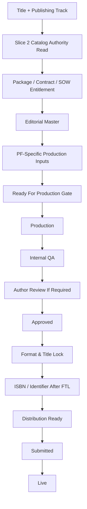

# PF Orchestration

Status: DESIGN ONLY
Implementation authority: NO

## Shared Orchestration Pattern

## PF-01 Paperback

Inputs:

- Editorial Master;
- trim, page count, interior type, cover file, imprint, price, rights;
- Slice 2 catalog authority for paperback or package entitlement;
- FTL before ISBN and submission.

Dependencies:

- `jm1pub_title`;
- `jm1pub_edition` or reconciled `jm1pub_publishingasset`;
- `jm1pub_commercialcatalogitem`;
- `jm1pub_editorialartifact`;
- `jm1_executionlog`.

Outputs:

- print-ready interior;
- cover spread;
- ISBN assigned after FTL;
- printer/distributor package;
- confirmed-live readback.

Artifacts:

- Editorial Master;
- print PDF;
- cover PDF;
- QA report;
- distribution submission receipt.

Approval gates:

- production readiness;
- internal QA;
- author review;
- FTL;
- distribution readiness.

## PF-02 Hardcover

Inputs:

- Editorial Master;
- hardcover trim, binding, jacket/casewrap details, cover spread, price, rights;
- catalog/package authority;
- FTL before ISBN and submission.

Dependencies:

- all PF-01 dependencies;
- hardcover-specific cover and binding requirements.

Outputs:

- hardcover interior and cover package;
- ISBN assigned after FTL;
- distribution/printer submission.

Artifacts:

- hardcover print files;
- hardcover QA report;
- channel submission proof.

Approval gates:

- same as PF-01 plus hardcover file conformance.

## PF-03 Standard Ebook

Inputs:

- Editorial Master;
- ebook styling and navigation;
- accessibility baseline;
- cover image;
- catalog/package authority;
- FTL before ISBN and submission.

Dependencies:

- born-accessible ebook requirements;
- no paid accessibility-upgrade substitution.

Outputs:

- EPUB or approved ebook package;
- ebook ISBN/identifier after FTL;
- channel submission package.

Artifacts:

- EPUB;
- validation report;
- cover image;
- metadata package.

Approval gates:

- ebook validation;
- internal QA;
- author review if required;
- FTL;
- distribution readiness.

## PF-04 Audiobook

Inputs:

- Editorial Master or narration script;
- narration method attribute: AI, Human Single-Voice, or Human Multi-Voice;
- audio production plan;
- pricing/quote authority from Slice 2;
- rights and narrator approval.

Dependencies:

- PF-04 remains one product form; narration method is an attribute, not a sub-form;
- human multi-voice remains quote/SOW where required.

Outputs:

- mastered audio files;
- chapter markers;
- cover/audio metadata;
- audiobook channel package.

Artifacts:

- narration script;
- audio masters;
- QA listen report;
- channel submission receipt.

Approval gates:

- narration method approval;
- audio QA;
- author review where required;
- distribution readiness.

## PF-05 Large Print

Inputs:

- Editorial Master;
- large-print layout specification;
- complexity attribute: Standard or Complex;
- catalog/package authority;
- FTL before ISBN and submission.

Dependencies:

- PF-05 remains one product form;
- no `PF-05C` product-form code.

Outputs:

- large-print interior;
- cover adjusted for trim/spine;
- ISBN after FTL;
- distribution package.

Artifacts:

- large-print PDF;
- conformance/legibility QA;
- distribution proof.

Approval gates:

- complexity approval;
- layout QA;
- author review if required;
- FTL;
- distribution readiness.

## PF-06 Complex-Content Accessibility Edition

Inputs:

- Editorial Master;
- complex content inventory;
- accessibility/conformance requirements;
- catalog authority;
- FTL before identifier/submission.

Dependencies:

- may require premium/conformance evidence;
- must not be confused with PF-03 born-accessible baseline.

Outputs:

- accessibility edition package;
- conformance evidence;
- distribution or delivery package.

Artifacts:

- accessible edition files;
- conformance report;
- QA report;
- author-facing status projection.

Approval gates:

- accessibility requirements approval;
- conformance QA;
- distribution readiness.

## PF-07 Vertical Graphic Edition

Inputs:

- none for sellable production under current authority.

Dependencies:

- PF-07 is SCHEMA_INERT;
- no commercial row is required;
- no placeholder sellable record is permitted.

Outputs:

- no commercial output under Slice 3 design.

Artifacts:

- gap/hold record only if future PF-07 activation is considered.

Approval gates:

- future executive authorization required before any activation design.

## PF-08 Interactive / Multimedia Edition

Inputs:

- Editorial Master;
- approved SOW/scope cap;
- interactive feature inventory;
- platform/technical requirements;
- canonical SKU `JMP-INT-EPUB3-STD`;
- Slice 2 active/SOW-gated authority.

Dependencies:

- PF-08 is ACTIVE / SOW-GATED;
- advanced features require SOW;
- ordinary production fails closed without approved scope.

Outputs:

- scoped interactive EPUB3 or multimedia deliverable;
- technical QA report;
- author review package;
- distribution or delivery plan if applicable.

Artifacts:

- SOW/scope approval;
- interactive build package;
- QA evidence;
- author-facing review.

Approval gates:

- approved scope;
- technical QA;
- author review;
- release/distribution readiness.

