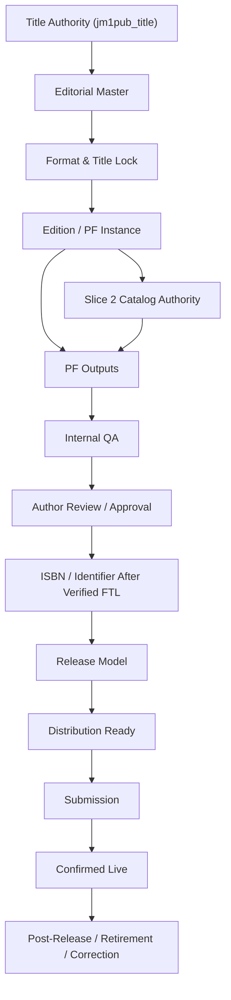

# Slice 3 Dependency Graph

Status: DESIGN ONLY
Implementation authority: NO

## Canonical Flow

## Dependency Table

| Dependency | Requires | Produces | Blocks if missing |
|---|---|---|---|
| Title authority | `jm1pub_title`, author/contract context | title identity and title-level status | all PF creation |
| Editorial Master | approved source artifact, version, checksum | PF production source | production readiness |
| Format & Title Lock | title metadata, format commitments, approval | locked title/format evidence | ISBN, release anchor, submission |
| Slice 2 catalog authority | `jm1pub_commercialcatalogitem` read | pricing, quoting, sellable/SOW/visibility posture | entitlement, quote, PF activation |
| PF output | Editorial Master, PF inputs, entitlement | production files/assets | QA, review, distribution |
| Internal QA | PF output, checklist | QA pass/fail | author review, approval |
| Author review | author-facing package, response path | author decision or publisher disposition | approval |
| Approval | author/internal approval or approved exception | approved PF version | distribution readiness |
| ISBN / identifier | verified FTL, PF/edition identity | ISBN/identifier evidence | distributor submission |
| Release model | release anchor, channel plan, propagation lead | release plan | distribution readiness |
| Distribution ready | package, metadata, ISBN/identifier, QA, release plan | submission permission | submission |
| Submission | channel package, human/future runtime authority | submission receipt | live status |
| Confirmed live | channel readback | live state | post-release lifecycle |
| Correction authority | approval, affected versions/PFs/channels | permitted return to production/correction flow | post-approval/live changes |

## Hard Gates

- Editorial Master must precede PF production outputs.
- FTL must precede ISBN assignment.
- ISBN/identifier must precede distribution submission where required.
- Release anchor and propagation lead must precede distribution ready.
- Submission must precede confirmed-live.
- `CORRECTION_AUTHORIZED` must precede post-approval or post-live rework.
- PF-07 must remain schema-inert.
- PF-08 must remain SOW-gated.
- Client-title automation must remain frozen.

## Companion Edition Dependency

Companion Editions are related edition/release-plan objects. They depend on:

1. parent title authority;
2. edition/PF identity;
3. package/entitlement authority;
4. no slot swapping;
5. separate FTL/ISBN/distribution evidence when the companion has its own edition identity.

## Release Dependency

Release requires:

- approved PF output;
- verified FTL;
- ISBN/identifier where applicable;
- release anchor;
- minimum 21-day propagation lead unless exception authority exists;
- distribution package;
- submission receipt;
- confirmed-live readback before `LIVE`.

