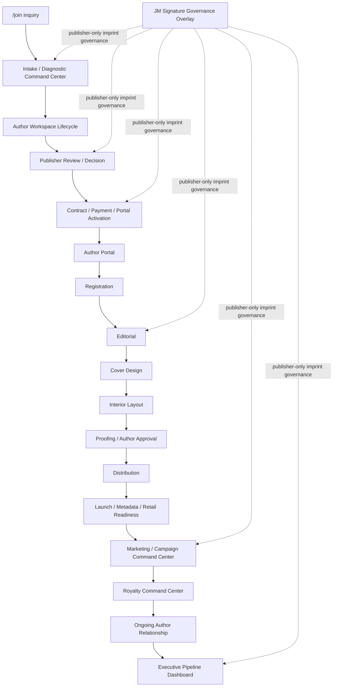

# PROGRAM-002 - Autonomous Publishing Production Pipeline

**Status:** APPROVED FOR CONTINUED IMPLEMENTATION / COUNCIL REVIEW CLOSED
**Date:** 2026-07-01
**Owner:** Jackie Smith Jr.
**Authority:** Jackie authorized PROGRAM-002 capture and control setup only
**Repository:** `C:\Developer\repos\jmerrill-pub`

## Executive Summary

PROGRAM-002 governs the self-running J Merrill Publishing production pipeline.

The vision is a manuscript entering the platform and, with appropriate human approvals, moving from inquiry to production, distribution, launch, marketing, royalty management, and ongoing author relationship management while the system orchestrates the work.

This program is operational, not theoretical. Each module must reach working production usefulness before the next module starts.

## Current State

The core blocker stack is closed:

- 1.1 Author Onboarding Notification
- 1.2 Choice Mapping Standard for the current implementation
- 1.4 Duplicate Flow Cleanup
- 1.5 `/join` / INT-PUB-005 Migration

Canonical pipeline distinction:

- `/join` starts the full publishing movement for new/prospective authors.
- `/author/onboarding` is a downstream production-spec step for accepted/current authors.

OP-001 is complete/operational. OP-002 is complete/operational after controlled validation on 2026-07-01 using Jackie Smith Jr's real active publishing project, `Establishing Glory: The Library`.

Council disposition v1.0 is accepted:

- OP-002 is the controlling gate. Completed 2026-07-01.
- OP-003 scope is locked and is now the next build item.
- Marketing is part of every OP module.
- JM Signature governance is locked as publisher-selected and invitation-only.
- Executive dashboard behavior is exception-driven.
- Council review is closed; implementation is active.

## Core Principle

Author-first. The author relationship is the parent; each title is a child milestone.

## Operating Principle

Build to operational completion one module at a time. No broad architecture loops. No partial future-state scaffolding that does not move production forward.

## Program Scope

PROGRAM-002 includes the operational modules needed to run J Merrill Publishing from author inquiry through ongoing relationship management:

1. Intake / Diagnostic Command Center
2. Author Workspace Lifecycle
3. Contract / Payment / Portal Activation Command Center
4. Author Portal
5. ISBN / LCCN / Copyright Registration Command Center
6. Editorial Command Center
7. Cover Design Command Center
8. Interior Layout Command Center
9. Proofing / Author Approval Command Center
10. Distribution Command Center
11. Launch / Metadata / Retail Readiness Command Center
12. Marketing / Campaign Command Center
13. Royalty Command Center
14. Ongoing Author Relationship Command Center
15. Executive Pipeline Dashboard
16. JM Signature Governance Overlay

## Out of Scope for Capture

This capture/control task does not authorize:

- building OP-001
- creating flows
- patching Power Automate
- modifying Dataverse
- modifying SharePoint
- modifying Business Central
- connecting Stripe
- sending author emails
- creating author portals
- creating SharePoint folders
- changing live website behavior
- committing or pushing repository changes

## Lifecycle

## Marketing Throughout Pipeline Rule

Marketing is not only a launch-stage activity. Each module must identify its marketing signal, handoff, or dependency where applicable.

Every future OP specification must include:

- Marketing Signal / Handoff
- Purpose
- Author-facing assets
- Internal assets
- Automation trigger
- Success criteria

Required marketing touchpoints:

| Stage | Marketing Signal / Dependency |
|---|---|
| Intake / Diagnostic | Positioning signal, audience, comparable titles, author platform, market category, reader promise |
| Publisher Review | Commercial opportunity, cultural relevance, campaign potential, author visibility, prestige/trade potential |
| Contract / Onboarding | Author marketing questionnaire, platform assets, media history, endorsements, speaking opportunities |
| Editorial | Message clarity, reader promise, audience alignment, positioning language |
| Cover / Interior | Market fit, genre expectation, prestige posture, campaign usability |
| Distribution | Metadata posture, categories, keywords, BISAC, retailer readiness, library/bookstore posture |
| Launch | Launch calendar, review strategy, campaign copy, media kit, email/social assets |
| Post-Launch | Review tracking, award submissions, long-tail optimization, campaign performance, author relationship opportunities for future titles |

The Marketing / Campaign Command Center must include:

- author marketing questionnaire
- book positioning
- audience definition
- campaign plan
- launch calendar
- social copy/assets
- press/media kit
- review request tracking
- award/submission tracking
- email campaign support
- bookstore/library/media outreach tracking where applicable
- post-launch optimization
- campaign performance summary
- author relationship marketing opportunities for future titles

## JM Signature Governance Overlay

JM Signature is the publisher-selected traditional/prestige imprint of J Merrill Publishing, Inc.

JM Signature is:

- invitation-only
- publisher-selected
- not purchasable
- not package-based
- not author-selected
- not automatically assigned by AI
- not a paid upgrade

Canonical rule: AI may flag. Publisher decides.

The system may flag `Potential JM Signature Candidate`, but final designation belongs exclusively to the Publisher. Authors may enter through `/join`, but they cannot apply directly for JM Signature and no public application path should exist.

Candidate criteria may include literary excellence, original thought, enduring cultural or historical significance, spiritual or societal impact, commercial opportunity, long-term catalog value, author distinction or platform credibility, elevated editorial or design potential, and trade/institutional/media/prestige-market potential.

JM Signature is an overlay, not a normal production module. It affects intake, review, contract path, editorial, design, launch, marketing, distribution, and executive oversight. Do not move JM Signature ahead of the core production machine. Each OP module must answer: does this module need JM Signature-specific governance?

## Management by Exception Doctrine

Every OP module must answer:

`If nothing is wrong, does Jackie need to know?`

If the answer is yes, the workflow should be redesigned. The platform should surface only:

- approval needed
- exception
- blocker
- missed SLA
- author risk
- payment issue
- production issue

Everything else should continue quietly through the operational workflow.

## Author Portal Rule

Create the Author Portal only when both conditions are true:

- Agreement status = signed/completed
- First payment status = paid/confirmed

The portal may display approved information from:

- Dataverse: author, title, project status, tasks, milestones
- SharePoint: files, proofs, documents
- Business Central: payment/accounting summary only when production-ready
- Stripe: payment confirmation only when live connection is approved
- Royalty engine: statements only when live royalty generation is approved
- Marketing module: approved launch plan, campaign tasks, assets, review/award tracking, and campaign milestones only when the marketing module is live

The portal must not become the system of record.

## OP-003 Scope Lock

OP-003 begins only after OP-002 successfully completes controlled production validation.

OP-003 scope is locked to:

- Author Portal
- Relationship Parent / Title Child
- controlled display layer
- status dashboard
- tasks
- approved documents
- payment confirmation
- contact pathway
- visual milestone tracker
- warm welcome transition
- humanized milestone communications
- file validation
- version protection
- metadata readiness

No additional OP-003 scope may be added without executive approval.

## System-of-Record Rule

- Dataverse is the operational publishing system of record.
- SharePoint is the file/workspace layer.
- Stripe is the payment collection layer.
- Business Central is the financial/accounting system of record.
- Author Portal is a display/action layer only.
- The portal must not become the system of record.

## SharePoint Workspace Rule

The SharePoint workspace is created at serious `/join` inquiry under:

`01_Pre-Pipeline/00_Inquiry`

The workspace moves through the existing lifecycle:

`01_Pre-Pipeline` -> `02_Active-Pipeline` -> post-distribution / ongoing relationship

Do not create duplicate folders.

The SharePoint workspace must mirror the pipeline but must not become the authority for stage/status. Dataverse remains the stage/status authority.

## Payment / Production-Start Rule

Do not reintroduce QBO as an operational dependency.

Publishing payment/accounting posture:

- Stripe collects approved online payments.
- Dataverse tracks agreement status, payment status, production authorization, and author/title stage.
- Business Central becomes the financial system of record.
- QBO is not the forward operating source.

No production start until both are true:

- Agreement status = signed/completed
- First payment status = paid/confirmed

Recommended payment policy:

- Default: signed agreement first, then payment link.
- Exception: Jackie may authorize payment link before signature case-by-case.

OP-002 bridge fields:

- `jm1_m6firstpaymentstatus`
- `jm1_m6firstpaymentconfirmedon`
- `jm1_m6firstpaymentconfirmationsource`
- `jm1_m6authorportalstatus`
- `jm1_workspacestatus`
- `jm1_sharepointworkspaceurl`
- `jm1_sharepointworkspacefolderid`

Reuse existing Contract fields:

- `jm1pub_status`
- `jm1pub_signeddate`

Reuse existing intake/title/submission stage fields for Current Pipeline Stage where possible.

## Pipeline Completion Rule

Each module must be built to operational completion before the next module starts.

Operational completion means:

- clear owner
- Dataverse status model identified
- SharePoint/file behavior identified if applicable
- Power Automate behavior identified if applicable
- human approval gate identified
- exception/failure path identified
- documentation updated
- test evidence defined
- no duplicate responder/function overlap
- next module dependency clearly stated

## System Ownership Matrix

| System | Owns | Does Not Own |
|---|---|---|
| Dataverse | Authors, titles, pipeline status, tasks, milestones, approvals, operational state, agreement/payment/production authorization state | Accounting ledger, file storage, payment processor truth |
| SharePoint | Author/title workspace files, manuscripts, proofs, production documents | System-of-record stage/status, accounting truth |
| Business Central | Accounting, financial system of record, payment/accounting summary when production-ready | Author relationship master, manuscript workflow |
| Stripe | Approved online payment collection and payment confirmation when live connection is approved | Author/title master data, accounting ledger |
| Royalty Engine | Royalty calculation and statements when live generation is approved | Live payments without authorization |
| Marketing Module | Positioning, campaign plan, launch calendar, campaign assets, review/award tracking, performance summary | Operational stage authority, accounting truth |
| Author Portal | Controlled author-facing view into approved data | System of record |
| Executive Pipeline Dashboard | Exceptions, approvals, blockers, missed SLAs, author risk, payment issues, production issues | Exhaustive activity feed |

## Dependencies

| Dependency | Required For | Status |
|---|---|---|
| PROGRAM-001 certified foundation | All PROGRAM-002 modules | Complete |
| OP-001 SharePoint workspace lifecycle | Workspace and file operations | Complete / Operational |
| Production Dataverse existing publishing solution | Intake and pipeline operations | Operational as-is |
| OP-002 bridge fields | Activation and workspace writeback | Complete / Operational |
| SharePoint write connector authentication | Automated folder creation and move | Restored |
| Business Central production readiness | Live payment/accounting summaries | Not production-ready |
| Stripe live approval | Live payment confirmation | Not authorized |
| Adobe Sign license/API entitlement | Automated agreement execution | Blocked |
| Live royalty generation approval | Portal statement display and live royalty operations | Not authorized |

## Known Blockers / Constraints

| Blocker / Constraint | Affects | Current Handling |
|---|---|---|
| Adobe Sign license/API entitlement blocked | Automated agreement execution | Continue approved manual/alternate agreement evidence path until entitlement is resolved |
| Payment timing policy must be locked before routine live use | Routine payment links | Default is signed agreement first, then payment link; Jackie may authorize exceptions |
| Business Central migration is a parallel financial dependency | Live accounting summaries and postings | Do not block intake/onboarding or active title movement; keep accounting display gated |
| Live Stripe not authorized | Payment confirmation from Stripe | Portal activation can require manual payment confirmation until live Stripe is approved |
| Marketing must not be delayed until launch | All modules | Capture marketing signal/handoff/dependency in each OP module |
| JM Signature must not become public or purchasable | Intake, review, contract, marketing, executive dashboard | Treat as publisher-only governance overlay |
| Distribution/launch/royalty automation gates remain closed until readiness gates are satisfied | OP-008 through OP-011 | Keep later-stage automation gated |
| Live royalty generation not authorized | Royalty statements in portal | Hide royalty statements until separately approved |

## Recommended Build Order

1. OP-001 SharePoint Workspace Lifecycle
2. OP-002 Contract / Payment / Portal Activation - complete / operational
3. OP-003 Author Portal MVP - next
4. OP-004 Registration Command Center
5. OP-005 Editorial Command Center
6. OP-006 Cover Design Command Center
7. OP-007 Interior Layout Command Center
8. OP-008 Distribution Command Center
9. OP-009 Launch / Metadata / Retail Readiness Command Center
10. OP-010 Marketing / Campaign Command Center
11. OP-011 Royalty / Relationship Dashboard

JM Signature remains an overlay. Do not move it ahead of the core production machine.

## First Recommended Operational Build

**OP-001 - SharePoint Workspace Lifecycle**

Reason:

The intake/onboarding paths now work. The next operational need is to make sure serious `/join` inquiries and accepted/current authors have a governed workspace lifecycle that mirrors the pipeline without creating duplicate folders or making SharePoint the system of record.

OP-001 has since been completed and validated as operational. OP-002 has also passed controlled operational validation. The next module is OP-003 Author Portal MVP.

## Validation Requirements

- Documentation-only changes for capture/control updates unless Jackie separately authorizes a build.
- `git diff --check`
- Documentation secret scan for tokens, keys, credentials, and secrets.
- No commit or push without separate Jackie authorization.

## Completion Criteria

PROGRAM-002 capture/control setup is complete when:

- PROGRAM-002 charter exists.
- PROGRAM-002 initial backlog exists.
- Author portal trigger is documented.
- Workspace lifecycle is documented.
- Module order is documented.
- Marketing-throughout-pipeline rule is documented.
- Marketing / Campaign Command Center is included.
- JM Signature governance overlay is documented as publisher-selected.
- Business Central / Stripe / Dataverse ownership distinction is documented.
- Production-start rule is documented.
- First build item is clearly identified as OP-001 SharePoint Workspace Lifecycle.
- No operational systems are modified by the capture/control task.
- Validation passes.

## Council Disposition v1.0

PROGRAM-002 council review is closed.

Implementation is active.

Next council engagement occurs only upon completion of a major operational milestone, a material architectural decision, an operational blocker requiring executive review, or Jackie request.

## Final Capture Result

PROGRAM-002 is approved for continued implementation.

No operational systems were modified by this capture/control update.
No flows were created.
No Dataverse schema was changed by this capture/control update.
No SharePoint structure was changed.
No Business Central or Stripe action was taken.
No external communications were sent.
No commit or push was performed.
